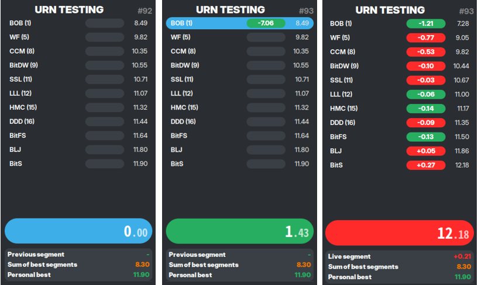

# Breeze Ann
A theme for the Urn speedrun splitter

## Example images

---

## Dependenies
- Urn

## Instalation
Copy the `breeze-ann.css` file to the `themes` folder, once you start Urn you can select it by using the theme shortcut.
OR copy the `breeze-ann.css` file into Urn's root directory and rename it to `urn-gtk.css` than recompile Urn.

---

### Note
The world record element wont work in this theme by default, I recommend removing this part from your split files.
